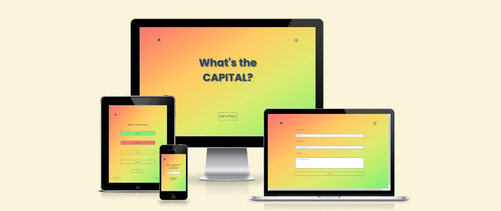
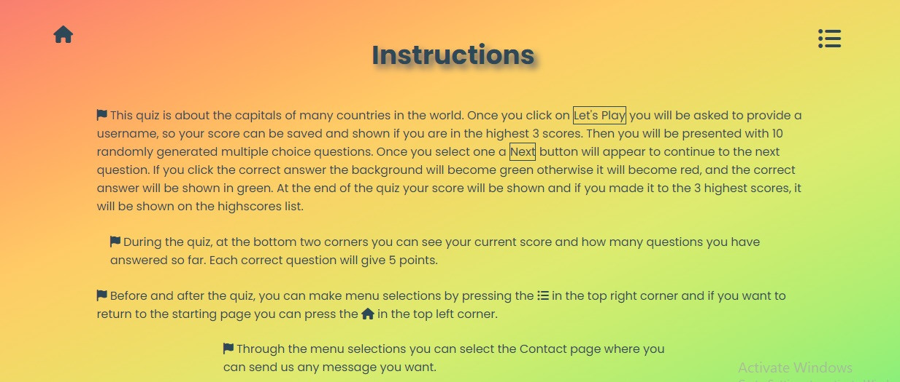
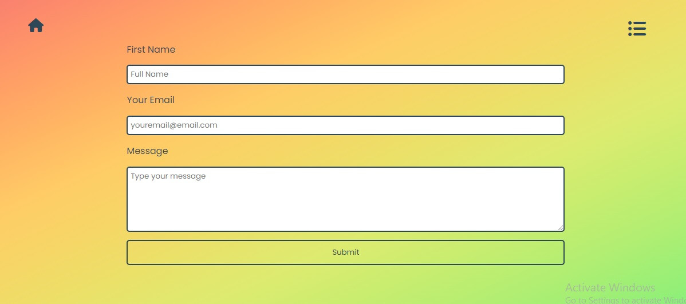
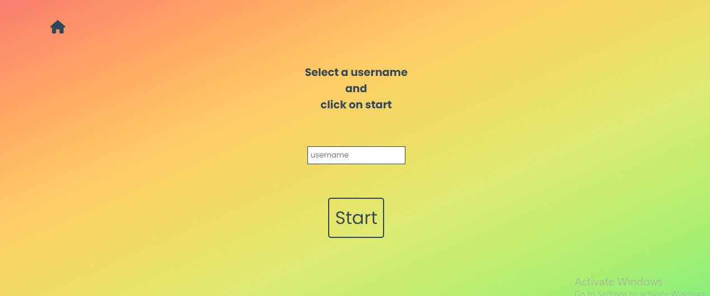
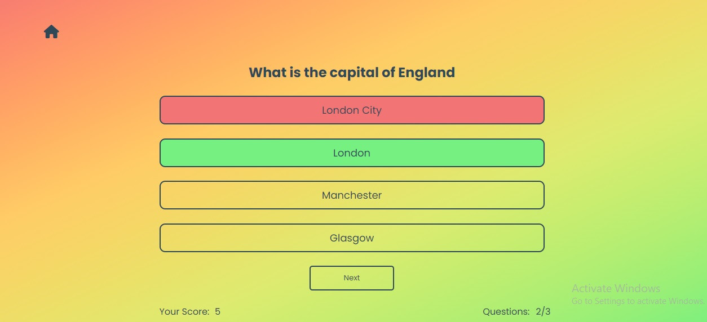

[Click here to see the webpage](https://parides55.github.io/capitals-quiz/)

# **What's the CAPITAL?**

The **What's the CAPITAL?** game it's an online quiz that is looking to give its users a fun way to get to know the capitals of many countries in the world. Also, this game shows what you can achieve with JavaScript, since the whole website runs with the help of JavaScript, and it's fully responsive with any device. The quiz has a 3 color gradient background, which is added to all the areas of the game, to add more interest and attract the user, and with the features it has, it makes the game easy to use and provide its users with a feedback regarding the final result.

<b>Table of Content</b>(click to open)

- [**What's the CAPITAL?**](#whats-the-capital)
  - [User Experience UX](#user-experience-ux)
  - [Features](#features)
    - [Existing Features](#existing-features)
    - [Features Left to Implement](#features-left-to-implement)
  - [Tecnnology Used](#tecnnology-used)
  - [Code Validation and Testing](#code-validation-and-testing)
    - [Validator Testing](#validator-testing)
  - [Deployment](#deployment)
  - [Credits](#credits)
    - [Content](#content)
    - [Media](#media)
  - [Other General Project Advice](#other-general-project-advice)
  
  

## User Experience UX

 - First time visitor

    - As a first time user, I am looking for what the site has to offer.

    - I would be looking how accessible is the site and its features.

    - And does the content of the site motivate and meet my search goal?

 - Returning visitor
  
    - As a returning user I want to find a feedback/oontact form.

    - I would like to find out other games extension to the current one.

 - Frequent visitor

    - As a frequent user to know about any updates made to the questions.
  

## Features

- The main feature of the whole webpage, which also helps a lot to make it fully responsive, is keeping the same structure of content throughout all the pages. All content are centerd and contained in a div which takes the full viewport height and width of the device. In some mobile devices, in order to accommodate more content the viewport height was extend beyond 100vh.
- The features available to use in the game are a home button, which always will bring you to the main landing page, a menu icon, which provides selections to the Instructions of the game, to view the 3 highest scores and to access the contact form, buttons that are designed to give a nice flow and control to the user to start the game, go to the next question or play again, and all of them have a hoover effect to clearly show the users that they are selectable and active. Each feature is designed to be easily identified and understoond and give to the user an easy way to navigate around the game.

### Existing Features

- **The Landing page**

  - The main Landing page which has in the middle a big tittle with the name of the game which attempts to make clear what the quiz is about.
  - Below the title is a big "Lets's Play!" button which attempts to attract the attention of the user to start playing the game.
  - In the left and right top corners the Home and Menu buttons are available for selection.

- **The Home Button**

  - The Home Button is always visible in the left top corner and is the only way to come back to the main landing page and start another game.
  - Also, is a way to stop your current game and start another one, since its available throughout the duration of the game in the left top conrer.

- **The Menu Button**

  

   - The Menu Button, which is an unordered list icon, once pressed it will give three selections for the user. To view the Instructions of the game, the three Highest Scores and to access the Contact form.
   - Once the selections are displayed the unordered list icon is replaced with a cross icon to indicated that when the user clicks on it the selections will be removed.
   - The three selections have a hoover effect as well to clearly indicate to the user which one is about to be selected.

- **The Instructions page**

  - This page contains all the instructions, not only how to play the quiz, but generally how to use and what to find in the whole webpage.
  - All the instructions are very simply written and to make it easier to distinguish them they are presented with a little flag icon bullet point.
  - Also, all the buttons of the game are shown as they are illustriated in the game, instead of been described, so it's easier for the user to identify them.

- **The Highscore page**

  - This section will allow the users to see how many points they scored and see if they made it to the top 3.
  - The page can be selected before the game starts through the menu selections, which in that case only the top 3 scores will be shown.
  - It will also be shown once the game has finished and in this case the score of the current user will be shown below the top 3 scores.
  - Below the user's score a Play Again button will appear to prompt, either the same user or a different one, to play again. Once this button is clicked it will take you to the username page.
  - Also, the menu icon remains available in this page, offers the users a way to navigate around the game.

- **The Contact Page**

  - This page provides a way to communicate with the users and it can be selected anytime the menu icon is available.
  - The users need to provide their Full Name and a valid email address and then they can write anything they want in the text area. If any of the fields is ommitted an alert is shown to advice the users to fill out any empty fields. 

  

   -  Once the users click the submit button below the form they will be directed into a Thank You page were they are initially greated and then their full message is visible. Also, their are adviced that they will be contacted on the email they have provide.
   -  At the bottom of the screen a little instruction to go back to the main landing page is included, so the users are not wondering what they need to do next.

- **The username page**

  - Once the "Let's Play" button, from the main landing page, is clicked the users are directed to this page and are asked to provide a username, so their scored can be linked with them and stored in the local storage of the browser.
  - The Start button will not allow the users to start the game without providing a username. If the users try to click the start button without a user name an alert will be generated asking the users to provide a username in order to continue.
  - In the username page only the Home icon is available to select since the game has partially started and the users shouldn't be distracted from other features, so they can have a clear path to follow.

- **The Game area**

  - This is the primary page where all the game is happing. It is presented in single column structure which makes it fully responsive in all devices. 
  - Once the game starts a randomly generate question is shown with it's associated answers. The four answers are buttons which at this time are enabled and every time the cursor hoover above them it becomes a pointer, to show that this selection is available.  Once a selection is made all four buttins become disabled and the cursor becomes a no-drop icon, which shows that no more selections are available.
  - If the users have answered correctly the whole button becomes green, otherwise becomes red and the correct answer is automaticaly highlighted as green. This provides a nice, immediate, feedback to the users regarding the correct answer since the quiz is aiming to educate as well.
  - Once the answer is shown a "Next" button appears below the answers and is available to be clicked from the users when they are ready. This way the users have time to review the answer, especially if they made the wrong selection.
  - At the bottom two corners the current score of the users if shown which gives them one point for every correct answer and also, how many questions the users answered and how many are left.

   - Correct answer

   - Wrong answer

### Features Left to Implement

   - In the future it will be nice to add a sound effect whenever a button is click. This will add more feedback to he users.
   - Also, to extent the game and include pictured questions.
   - And to actually receive the users mesages from the contact form, as it is now, it only displays a thank you page as a feedback.

## Tecnnology Used

- HTML was used to build the content of the webpage.
- CSS was used to style the webpage.
- JavaScript was used to add logic to the game and activate all its features.
- GitHub was used to store the code and deploy it.
- CodeAnywhere was used to write the code.
- [FontAweswom](https://fontawesome.com/search?q=home&o=r&m=free) was used to select the icons for the webpage.
- [Am I Responsive](https://ui.dev/amiresponsive) was used to check for website's responsivness.
- [ColorSpace](https://mycolor.space/?hex=%23656466&sub=1) was use to select the colors of the webpage, together with the 3 color gradient apply on the background.

## Code Validation and Testing

### Validator Testing

- HTML
  - No errors were returned when passing through the official [W3C validator](Validator.nu/LV <http://validator.w3.org/services>)
  
  
- CSS
  - No errors were found when passing through the official [(Jigsaw) validator](https://jigsaw.w3.org/css-validator/validator)

- JavaScript
  - No errors were found when passing through the official [Jshint validator](https://jshint.com/)
    - The following metrics were returned:
    - There are 16 functions in this file.
    - Function with the largest signature takes 2 arguments, while the median is 0.
    - Largest function has 21 statements in it, while the median is 9.
    - The most complex function has a cyclomatic complexity value of 10 while the median is 1.

- LightHouse Reports

## Deployment

This section should describe the process you went through to deploy the project to a hosting platform (e.g. GitHub)

- The site was deployed to GitHub pages. The steps to deploy are as follows:
  - In the GitHub repository, navigate to the Settings tab
  - From the source section drop-down menu, select the Master Branch
  - Once the master branch has been selected, the page will be automatically refreshed with a detailed ribbon display to indicate the successful deployment.

[The live link can be found here](https://parides55.github.io/capitals-quiz/)

## Credits

In this section you need to reference where you got your content, media and extra help from. It is common practice to use code from other repositories and tutorials, however, it is important to be very specific about these sources to avoid plagiarism.

You can break the credits section up into Content and Media, depending on what you have included in your project.

### Content

- The text for the Home page was taken from Wikipedia Article A
- Instructions on how to implement form validation on the Sign Up page was taken from [Specific YouTube Tutorial](https://www.youtube.com/)
- The icons in the footer were taken from [Font Awesome](https://fontawesome.com/)

### Media

- The photos used on the home and sign up page are from This Open Source site
- The images used for the gallery page were taken from this other open source site

Congratulations on completing your Readme, you have made another big stride in the direction of being a developer!

## Other General Project Advice

Below you will find a couple of extra tips that may be helpful when completing your project. Remember that each of these projects will become part of your final portfolio so it’s important to allow enough time to showcase your best work!

- One of the most basic elements of keeping a healthy commit history is with the commit message. When getting started with your project, read through [this article](https://chris.beams.io/posts/git-commit/) by Chris Beams on How to Write  a Git Commit Message
  - Make sure to keep the messages in the imperative mood

- When naming the files in your project directory, make sure to consider meaningful naming of files, point to specific names and sections of content.
  - For example, instead of naming an image used ‘image1.png’ consider naming it ‘landing_page_img.png’. This will ensure that there are clear file paths kept.

- Do some extra research on good and bad coding practices, there are a handful of useful articles to read, consider reviewing the following list when getting started:
  - [Writing Your Best Code](https://learn.shayhowe.com/html-css/writing-your-best-code/)
  - [HTML & CSS Coding Best Practices](https://medium.com/@inceptiondj.info/html-css-coding-best-practice-fadb9870a00f)
  - [Google HTML/CSS Style Guide](https://google.github.io/styleguide/htmlcssguide.html#General)

Getting started with your Portfolio Projects can be daunting, planning your project can make it a lot easier to tackle, take small steps to reach the final outcome and enjoy the process!
